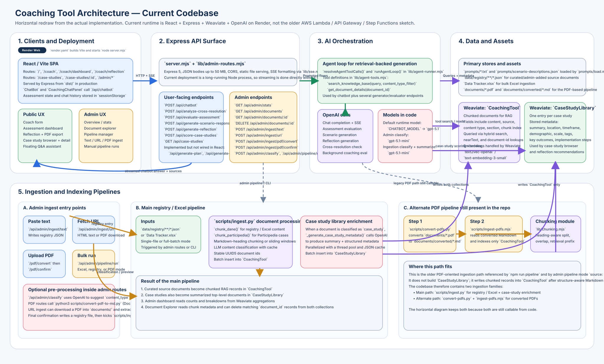

# Current Architecture

This diagram is drawn from the current implementation in the repo.

Key points:

- Runtime is `React + Vite` served by `Express` from [`server.mjs`](/Users/kushalpendekanti/Documents/AI4Impact_Co-op/coaching-tool-public-engagement/server.mjs), deployed as a Render web service via [`render.yaml`](/Users/kushalpendekanti/Documents/AI4Impact_Co-op/coaching-tool-public-engagement/render.yaml).
- Retrieval-backed generation uses `OpenAI` plus Weaviate collections `CoachingTool` and `CaseStudyLibrary`.
- There are two ingestion families in code:
- Main path: [`scripts/ingest.py`](/Users/kushalpendekanti/Documents/AI4Impact_Co-op/coaching-tool-public-engagement/scripts/ingest.py) for registry / Excel ingestion and case-study enrichment.
- Alternate path: [`scripts/convert-pdfs.py`](/Users/kushalpendekanti/Documents/AI4Impact_Co-op/coaching-tool-public-engagement/scripts/convert-pdfs.py) + [`scripts/ingest-pdfs.mjs`](/Users/kushalpendekanti/Documents/AI4Impact_Co-op/coaching-tool-public-engagement/scripts/ingest-pdfs.mjs) for converted PDFs.
- The older AWS/serverless diagram does not match the current codebase.
