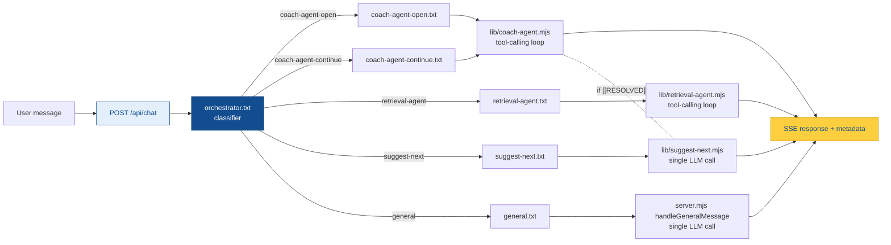

# System Prompt Architecture

How the coaching tool routes every user message through a small set of specialised LLM agents, each backed by a dedicated prompt file in [`prompts/`](../prompts/).

This document is about **transparency**: what each prompt does, why it exists, how the orchestrator decides which one to fire, and what contracts each agent is expected to honour. No new code — the system is already built. This doc explains it.

---

## Big picture

Every user message sent to the unified chat endpoint flows through the same pipeline:



Three things make this architecture work:

1. **One prompt file per agent role.** Each file in [`prompts/`](../prompts/) corresponds to exactly one thing the system can do. No branching mega-prompt, no inline system strings scattered across the codebase.
2. **Action names match file names.** When the orchestrator returns `"action": "coach-agent-open"`, you can find the prompt that will handle it at `prompts/coach-agent-open.txt`. One-to-one, no translation layer.
3. **The orchestrator never touches knowledge base retrieval.** It is a cheap, fast classifier — a single LLM call at `temperature: 0` that reads the session state and the user's latest message, then returns a tiny JSON payload. All the expensive tool-calling work happens downstream in the agent that gets picked.

---

## The prompts/ folder at a glance

Eight prompt files, each loaded at module-load time by [`prompts/load.mjs`](../prompts/load.mjs) and exported as a JavaScript constant:

| File | Exported as | Consumer | What it does |
|---|---|---|---|
| [`orchestrator.txt`](../prompts/orchestrator.txt) | `ORCHESTRATOR_PROMPT` | [`lib/orchestrator.mjs`](../lib/orchestrator.mjs) | Classifies each user message into one of five routing actions |
| [`coach-agent-open.txt`](../prompts/coach-agent-open.txt) | `COACH_AGENT_OPEN_PROMPT` | [`lib/coach-agent.mjs`](../lib/coach-agent.mjs) | Runs the opening turn of a coaching conversation on a new Nesta question |
| [`coach-agent-continue.txt`](../prompts/coach-agent-continue.txt) | `COACH_AGENT_CONTINUE_PROMPT` | [`lib/coach-agent.mjs`](../lib/coach-agent.mjs) | Runs mid-conversation coaching turns on an already-active question |
| [`retrieval-agent.txt`](../prompts/retrieval-agent.txt) | `RETRIEVAL_AGENT_PROMPT` | [`lib/retrieval-agent.mjs`](../lib/retrieval-agent.mjs) | Handles "show me examples" / "I'm stuck" / "how do others do this?" requests |
| [`suggest-next.txt`](../prompts/suggest-next.txt) | `SUGGEST_NEXT_PROMPT` | [`lib/suggest-next.mjs`](../lib/suggest-next.mjs) | Picks 2–3 Nesta questions to work on next after one has resolved |
| [`general.txt`](../prompts/general.txt) | `GENERAL_PROMPT` | [`server.mjs`](../server.mjs) `handleGeneralMessage` | Handles greetings, goodbyes, meta-questions, small talk, and anything off-topic |
| [`generate-reflection.txt`](../prompts/generate-reflection.txt) | `GENERATE_REFLECTION_PROMPT` | [`server.mjs`](../server.mjs) `/api/chat/reflection` | Produces the end-of-session evidence-grounded reflection report |
| [`classify-document.txt`](../prompts/classify-document.txt) | `CLASSIFY_SYSTEM` | [`lib/admin-routes.mjs`](../lib/admin-routes.mjs) + [`lambda/llm-json.mjs`](../lambda/llm-json.mjs) | Document classifier used by the admin ingest pipeline |

Six of these eight run during a live coaching conversation. The last two (`generate-reflection`, `classify-document`) run at session endpoints — one at the end of a coaching session, one during document ingest.

---

## The orchestrator

The orchestrator is the brain stem of the conversation: cheap, fast, stateless (in the LLM sense — it reads state that's passed in, but it doesn't store anything itself), and opinionated about one thing only — *which agent should handle this message*.

### What it sees

On every `/api/chat` request, [`lib/orchestrator.mjs`](../lib/orchestrator.mjs) sends the LLM two things:

1. **System prompt** — [`prompts/orchestrator.txt`](../prompts/orchestrator.txt) with `{{NESTA_QUESTIONS}}` replaced by the current list of the 9 Nesta framework questions (so the classifier can distinguish a message about Q3 "participant reach" from a message about Q8 "evaluation criteria").
2. **User content** — a block containing:
   - **SESSION STATE**: the full per-question status summary built by `buildStateSummaryForLLM`, including which questions are `addressed` / `in-progress` / `not-started`, and which question (if any) is currently being coached (`activeQuestionId`).
   - **USER MESSAGE**: the raw message the practitioner just typed.

### What it returns

Strict JSON only, no markdown fences:

```json
{
  "action": "coach-agent-open|coach-agent-continue|retrieval-agent|suggest-next|general",
  "questionId": <number 1-9 or null>,
  "reasoning": "one sentence explaining your decision"
}
```

The JavaScript side parses this, validates the action against the allowlist, validates `questionId` is in the `[1, 9]` range (setting it to `null` otherwise), and then dispatches based on the action.

### The five actions — why each one exists

Every action name is identical to the filename of the prompt that will handle it. This is deliberate: when debugging, an `[orchestrator]` log line saying `→ coach-agent-open` tells you exactly which file will fire next, with no mental translation.

#### `coach-agent-open`

**Fires when:** the user's message maps to a Nesta question but they are **not** currently mid-conversation on it. Three concrete triggers:
- The user describes their project for the first time and it clearly touches on a specific question.
- The user picks a suggested question to work on next.
- The user switches to a different question from the one they were just working on.

**Returns:** the `questionId` of the question to open coaching on.

**Why a dedicated "open" prompt?** Opening turns have different goals than mid-conversation turns. An opening turn needs to *welcome* the user into a new question, orient them, and draw out their specific situation with an open, inviting probe. A mid-conversation turn needs to *evaluate* the user's latest response against what's already been established and either push for specifics or resolve. Using the same prompt for both made the coach oscillate between these modes awkwardly.

#### `coach-agent-continue`

**Fires when:** there's already an active question being coached (`activeQuestionId` is not null) and the user's message is a direct response to the coach's last probe — they're elaborating, answering, refining, or proposing something.

**Returns:** the active `questionId`.

**Why split it from `coach-agent-open`?** See above — different turn shape, different resolution expectations (continue turns strongly lean toward resolving after 3+ exchanges; open turns almost never resolve on turn 1).

Note: the orchestrator collapses both `coach-agent-open` and `coach-agent-continue` into `handler: 'coach'` when it dispatches. The *prompt selection* happens inside [`lib/coach-agent.mjs`](../lib/coach-agent.mjs), where `buildSystemPrompt` picks either `COACH_AGENT_OPEN_PROMPT` or `COACH_AGENT_CONTINUE_PROMPT` based on the original action passed from `server.mjs`. The default when no action is specified is *continue* — the safer fallback since most coaching turns are mid-conversation.

#### `retrieval-agent`

**Fires when:** the user is stuck, confused, asking for examples, or requesting evidence. Concrete triggers:
- Explicit asks: "show me examples", "do you have a case study on this?", "what have others done?"
- "I don't know" / "I'm not sure" / "I need help"
- The user seems lost and needs information before they can continue coaching.

**Returns:** the `questionId` for context (the active one if any, else `null`).

**Why a dedicated retrieval agent instead of letting the coach handle it?** The coach agent is Socratic — its job is to *ask*, not *tell*. When the user is stuck, that mode is counter-productive: they don't need another probing question, they need examples and evidence. The retrieval agent flips the stance: it searches the knowledge base twice (minimum) with different queries, synthesises the findings, cites sources, and ends by connecting the evidence back to the user's situation. After the retrieval turn, the next message typically routes back to `coach-agent-continue`.

#### `suggest-next`

**Fires when:** the current question has just been resolved, or the user explicitly asks "what should I work on next?". Critically: it does **not** fire just because the user finished one thought — only when a question is fully resolved.

**Returns:** `questionId` is `null` (this action picks the next questions itself; the orchestrator doesn't pre-choose one).

**Auto-trigger path:** This is the one case where an action can fire *without* going through the orchestrator. In [`server.mjs`](../server.mjs), when the coach agent's response contains the `[[RESOLVED]]` marker, the chat handler immediately calls the suggest-next handler and appends its output to the coach's affirmation message. This is why a single user turn can produce *both* a coach response *and* a suggestion list in the same SSE frame.

#### `general`

**Fires when:** the message is a greeting, thank-you, goodbye, off-topic remark, meta-question about the tool, or small talk that doesn't map to any Nesta question.

**Returns:** `questionId` is `null`.

**Why a dedicated `general.txt` file?** The general handler used to be an inline system string buried in [`server.mjs`](../server.mjs) with a two-branch `isNewSession ? ... : ...` condition. It grew over time and was hard to iterate on without touching code. Moving it to a prompt file with template variables (`{{addressedCount}}`, `{{inProgressCount}}`, `{{activeQuestion}}`) let it grow into a proper branched instruction covering 8 distinct message types (new-user greeting, returning-user greeting, thanks, goodbye, meta-question, off-topic, confused/lost, "show me the questions"), each with its own tone and length guidance — all editable by changing the text file, not the code.

### The decision rules

The orchestrator prompt contains four explicit tie-breaker rules, each written to reduce a known failure mode observed in practice:

| Rule | Why |
|---|---|
| If there's an active question AND the user's message is a response to the coach (not a topic switch or help request), **always choose `coach-agent-continue`**. | This is the most common case during a coaching session. Keeping the orchestrator biased toward `continue` prevents it from misreading elaboration as a new topic. |
| If the user's message clearly relates to a **different** question than the active one, choose **`coach-agent-open`** with the new questionId. | Lets users steer the conversation. Without this rule, the orchestrator was anchoring too hard on the currently-active question and ignoring explicit topic switches. |
| When in doubt between `coach-agent-continue` and `retrieval-agent`, **lean toward `coach-agent-continue`**. | The coach agent has its own tool-calling loop and can internally decide to fetch evidence. Only route to `retrieval-agent` when the user is *explicitly* asking for external information or is clearly stuck. This prevents over-eager retrieval from interrupting productive coaching. |
| When in doubt between `coach-agent-open` and `general`, **lean toward `coach-agent-open`**. | Most messages from practitioners relate to their engagement project. Biasing toward `coach-agent-open` prevents the tool from brushing off substantive project descriptions as small talk. |

### Fallback on parse error

If the orchestrator returns malformed JSON (rare but it happens), [`lib/orchestrator.mjs`](../lib/orchestrator.mjs) catches the parse failure and substitutes a sensible default:

- If there's an active question being coached → fall back to `coach-agent-continue` on that question.
- Otherwise → fall back to `general`.

The practitioner never sees an error — they see a slightly-off response, and the next turn usually recovers.

---

## The coach agents — open and continue

Both open and continue share the same runtime loop in [`lib/coach-agent.mjs`](../lib/coach-agent.mjs). The only things that differ between them are:

1. **Which prompt file is loaded** as the base system prompt.
2. **The situational framing** inside that prompt (opening vs. mid-conversation).

Everything else is shared and consistent across both prompts by design — the user can't tell where one ends and the other begins, only that the coach feels appropriate for the moment.

### What both prompts share (overlap is deliberate)

- **Identity:** warm, Socratic public engagement coach grounded in the Nesta framework.
- **Knowledge base contract:** MUST search the knowledge base at least once per coaching turn before responding. Search again with different queries if the first results are insufficient.
- **Template variables:** `{{question}}`, `{{explanation}}`, `{{userResponse}}`.
- **Citation format:** numbered inline references (`¹²³` preferred, `<sup>1</sup>` or `(1)` as fallback) followed by a `**Sources:**` section at the end of the message with markdown hyperlinks to the source URLs returned by the tool calls. See [Citation contract](#citation-contract) below.
- **One focused probing question at a time** — no multi-part probes, no lists of sub-questions.
- **Length ceiling:** 2–4 sentences plus one question. Strictly enforced because longer responses degrade the coaching feel.
- **Resolution marker:** the string `[[RESOLVED]]` at the end of the message signals the system to mark the question as `addressed` and auto-trigger the suggest-next flow.
- **Stay focused on the current question.** If the user drifts into territory belonging to a different Nesta question, gently hold focus — the orchestrator will route the next message to whichever question the user actually cares about.

### What differs between open and continue

| Aspect | `coach-agent-open.txt` | `coach-agent-continue.txt` |
|---|---|---|
| Conversation state | No prior coaching exchanges on this question | Prior exchanges already exist in the message history |
| User input label | `USER'S FRAMING SO FAR` | `USER'S RESPONSE SO FAR` |
| Primary goal | Welcome, orient, draw out the user's specific situation with an open probe | Evaluate the user's latest response and either deepen or resolve |
| First move | Acknowledge what the user just shared + one-sentence orientation to the question | Read the prior history, identify what's been established and what's still vague |
| Resolution stance | Possible but uncommon — only if the opening framing is already unambiguously complete | Expected — especially after 3+ exchanges, strongly lean toward resolving |
| 3+ exchanges rule | Documented for awareness, but typically fires on a later turn, not this one | Active rule — triggers a turn-count nudge injected by `buildSystemPrompt` |

### What happens in the code

[`lib/coach-agent.mjs`](../lib/coach-agent.mjs) → `coachResponse(questionId, userMessage, session, action)`:

1. **Resolve the Nesta question** by id and the question-specific state from the session (history, current `userResponse`, gap if any).
2. **Pick the base prompt** — `COACH_AGENT_OPEN_PROMPT` if `action === 'coach-agent-open'`, otherwise `COACH_AGENT_CONTINUE_PROMPT`.
3. **Template the prompt** with `{{question}}`, `{{explanation}}`, and `{{userResponse}}` (compiled from the coaching history if no summarised response exists yet).
4. **Append context from previously answered questions** so the coach avoids re-asking things the user has already addressed on other questions.
5. **Inject a turn-count nudge** if the user has already had 3+ exchanges on this question. The nudge text is dynamic (not in the prompt file): *"IMPORTANT: This is exchange #N… you should strongly lean toward resolving now."*
6. **Replay the coaching history** as alternating `user` / `assistant` messages so the LLM sees the full in-question context.
7. **Run the tool-calling loop** via [`lib/agent-runner.mjs`](../lib/agent-runner.mjs) with `agentToolDefinitions` (currently `search_knowledge_base` and `get_document_details`) and a max of `AGENT_MAX_ITERATIONS` iterations (default: 3).
8. **Check for the `[[RESOLVED]]` marker** in the output. If present, strip it from the user-visible message, mark the question as `addressed`, compile the user's accumulated responses into `qState.userResponse`, and return `resolved: true`.
9. **Return** the cleaned message, the resolved flag, and the sources collected from the tool calls.

After the coach returns, [`server.mjs`](../server.mjs) inspects the `resolved` flag and — if true — immediately calls `handleSuggestNext` and concatenates its output onto the coach's message (separated by `\n\n---\n\n`). This is why resolving a question produces a single SSE frame that contains both the affirmation and the next-question suggestions.

---

## The retrieval agent

**Purpose:** handle "I'm stuck" / "show me examples" / "how do others do this?" requests without trying to coach. This agent flips the tool's stance from *asking* to *providing*.

### Prompt structure ([`retrieval-agent.txt`](../prompts/retrieval-agent.txt))

**Template variables:**
- `{{CONTEXT_BLOCK}}` — if there's an active Nesta question, the code inserts a block naming which question the user is currently on, so the retrieval is scoped appropriately.
- `{{userQuery}}` — the user's verbatim message.

**Behavioural contract:**
- **MUST search at least twice** with different queries (higher bar than the coach agent's "at least once") so the retrieval has comprehensive coverage.
- **Synthesise, don't dump.** Frame findings as supportive, directly address what the user asked, give 1–2 concrete examples, end by connecting back to their specific situation.
- **2–4 paragraphs maximum.** Concise and practical.
- **Every method or approach cited** must be backed by a retrieved document, with numbered inline citation + a `**Sources:**` section at the end (same contract as the coach agents).
- **Honesty on gaps.** If no relevant evidence exists for part of the query, explicitly say: *"Based on available resources, I don't have specific guidance on this."* — never fabricate.

### Why it exists as a separate agent

The coach agent could, in theory, fetch evidence inside its own tool loop. Why carve retrieval out?

1. **Different output shape.** Coach responses are 2–4 sentences plus one question. Retrieval responses are 2–4 paragraphs of synthesised evidence. Sharing a single prompt forced one or the other to be uncomfortable.
2. **Different search budget.** The coach searches at least once, with a soft budget. The retrieval agent searches at least twice, with explicit instructions to re-query if the first results are insufficient.
3. **Different stance.** Coach is Socratic (asks). Retrieval is informative (provides). Mixing them confused the LLM's tone and made it sometimes lecture mid-coach-turn.
4. **The orchestrator can guard the boundary.** Because routing is centralised, the orchestrator's tie-breaker rule *"lean toward coach-agent-continue"* prevents the retrieval agent from firing on messages that are just elaboration. Retrieval only runs when the user explicitly needs it.

---

## The suggest-next agent

**Purpose:** after a question is resolved, pick 2–3 remaining questions that would build most naturally on what the practitioner just discussed.

### Prompt structure ([`suggest-next.txt`](../prompts/suggest-next.txt))

**Template variables:**
- `{{RESOLVED_CONTEXT}}` — the question that just resolved, plus a summary of what the user established.
- `{{COMPLETED_QUESTIONS}}` — questions already addressed (so the suggester doesn't recommend them).
- `{{REMAINING_QUESTIONS}}` — questions not yet resolved (the actual candidate pool).
- `{{RECENT_CONVERSATION}}` — the tail of the chat so the LLM can ground its reasoning in what the user actually said.

**Output contract:** strict JSON only, no markdown fences:

```json
{
  "suggestions": [
    { "questionId": <number 1-9>, "reason": "one sentence connecting to their work" }
  ]
}
```

**Picking criteria** (from the prompt itself):
1. Build naturally on what the practitioner just covered.
2. Are most critical for their specific project based on the conversation so far.
3. Would benefit from being addressed next (considering logical dependencies — e.g., you can't think about *how to reach participants* (Q3) before you've decided *who the participants are* (Q2)).

### Why it is a single LLM call (no tool loop)

The suggestion task doesn't need knowledge base search — it needs to reason about the Nesta question dependency graph and the user's specific context. Both are already in the prompt input. Adding a tool loop would be pure overhead.

### Why it is triggered both by orchestrator and auto-triggered by coach

Two entry points, one handler:

1. **Orchestrator path** — when the user explicitly asks "what should I work on next?", the orchestrator returns `action: "suggest-next"` and [`server.mjs`](../server.mjs) calls `handleSuggestNext` directly.
2. **Auto-trigger path** — when the coach agent returns `[[RESOLVED]]`, [`server.mjs`](../server.mjs) calls `handleSuggestNext` *without* going through the orchestrator and splices the result onto the coach's message.

The auto-trigger path exists because the experience of resolving a question and *then* having to ask "what's next?" felt broken. Suggesting the next two or three questions in the same SSE frame as the affirmation keeps momentum.

---

## The general agent

**Purpose:** everything that isn't coaching, retrieval, or next-question suggestion. The `general` handler is the conversational glue that keeps the tool feeling human between the specialised agents.

### Prompt structure ([`general.txt`](../prompts/general.txt))

**Template variables:**
- `{{addressedCount}}` — number of Nesta questions resolved so far (lets the prompt branch between new-user welcome and returning-user re-engagement).
- `{{inProgressCount}}` — number of questions currently mid-conversation.
- `{{activeQuestion}}` — the currently-coached question formatted as `"Q5 — \"Have you included incentives for participation?\""`, or `"None"` if there's no active question.

**Eight branches** inside the prompt, each with its own tone and length guidance:

1. **New-user greeting** (`addressedCount === 0 && inProgressCount === 0`) — warm welcome, invite project description, don't list all 9 questions.
2. **Returning-user greeting** — acknowledge progress, offer a next step, don't re-explain the tool.
3. **Thanks / appreciation** — brief warm acknowledgement, optional invitation to continue.
4. **Goodbye** — brief warm farewell, note that progress is saved.
5. **Meta-question about the tool** — 2–4 sentence explanation of the Nesta framework coaching loop.
6. **Off-topic / small talk** — brief warm response, gentle steer back toward coaching, no moralising about staying on topic.
7. **Confused or lost user** — acknowledge confusion, offer one clear next step, don't overwhelm.
8. **Request to see questions or progress** — short structured overview of what's addressed / in progress / remaining.

### Explicit guardrails

The general prompt has several "do not" rules specifically to prevent it from bleeding into the specialised agents' territory:

- **Do not coach.** If the user starts describing a project or asking a coaching-type question, acknowledge warmly and let the orchestrator route the *next* message to the coach. Do not pre-empt coaching here.
- **Do not cite sources or reference the knowledge base.** That is the coach's and retrieval agent's job.
- **Do not include `[[RESOLVED]]` or any system markers.**
- **Do not list all 9 Nesta questions** unless explicitly asked.
- **Keep it to 2–3 sentences** (4 max for meta-questions).

These guardrails exist because, when this logic lived as an inline string inside `server.mjs`, the general handler would occasionally drift into coaching or retrieval mode and produce weirdly long, source-citing replies to simple greetings. The dedicated prompt file lets us enforce the boundary explicitly.

---

## Generate-reflection (end-of-session)

**Purpose:** produce the in-depth reflection report shown on `/coach/reflection` after a user has worked through one or more questions.

### What makes it different from the coach agent

- **Not a turn-by-turn agent.** It runs once at the end of a session (triggered by `POST /api/chat/reflection`), not on every user message.
- **Evidence is pre-fetched, not tool-called.** [`server.mjs`](../server.mjs) runs `searchKnowledgeBase` in parallel across all 9 questions, deduplicates the hits, formats them into a context block, and includes everything in the single LLM call. This avoids a multi-iteration agent loop and keeps the reflection generation fast.
- **Strict JSON output schema.** Unlike the coach/retrieval agents which return prose, the reflection returns a structured payload with `summary`, `addressed[]`, `partial[]`, `notAddressed[]`, and `priorityActions[]` arrays. The frontend renders these into the reflection page.
- **Accounts for the full coaching journey.** The prompt is told about four coaching conversation scenarios (PRODUCTIVE / RESOLVED_WITHOUT_CONVERSATION / UNRESOLVED_WITH_ACTIVE_CONVERSATION / NO_COACHING_SESSION) and must tailor its analysis to acknowledge growth shown in the dialogue, flag skipped coaching, and note unresolved items.

**Why no numbered citation format here:** the reflection's output is already strict JSON with dedicated fields — adding numbered inline citations would require either schema changes (a new `sources[]` array per analysis block) or embedding markdown inside JSON fields, both of which complicate the frontend renderer. This is flagged as a follow-up candidate but not implemented today.

---

## Classify-document (admin ingest)

**Purpose:** categorise an ingested document into one of ten content types (`case_study`, `transcript`, `blog_post`, `journal_article`, `report`, `guide`, `policy_brief`, `lecture`, `tool_or_resource`, `other`) and produce a 1–2 sentence summary.

**Consumers:**
- [`lib/admin-routes.mjs`](../lib/admin-routes.mjs) — called by the Express dev server's `/api/admin/classify` route when the admin pipeline UI uploads a document.
- [`lambda/llm-json.mjs`](../lambda/llm-json.mjs) — called by the deployed admin Lambda for the same `/api/admin/classify` route in production.

**Output contract:** strict JSON `{ content_type, summary }`, no markdown fences. The handler validates `content_type` against the allowlist and falls back to `"other"` if the LLM returns something unexpected.

**Why a separate tiny prompt:** this is a bounded classification task, not a coaching task. Sharing any prompt structure with the coaching agents would pollute both. Keeping it as a standalone file (and using a smaller, faster model via `CLASSIFY_MODEL` defaulting to `gpt-5.1-mini`) keeps ingest throughput fast and cheap.

---

## Citation contract

Three prompts — `coach-agent-open.txt`, `coach-agent-continue.txt`, and `retrieval-agent.txt` — emit numbered inline citations followed by a Sources section. The format is identical across all three:

### Inline markers

Placed immediately after the supported statement, before sentence-ending punctuation. The prompts specify a preference order:

1. **Unicode superscript digits** (`¹ ² ³ ⁴ ⁵ ⁶ ⁷ ⁸ ⁹`) — preferred because they render as small superscripts in any markdown renderer without requiring HTML.
2. **`<sup>1</sup>`** — acceptable fallback when Unicode superscript isn't suitable.
3. **`(1)`** — last-resort plain-text fallback.

### Numbering rules

- Sequential in order of first appearance in the response body (first cited source = `1`, next new source = `2`, and so on).
- Reuse numbers for repeat citations — if the same source is cited three times, it stays `¹` all three times.

### Sources section

Appears at the very end of the response (after any `[[RESOLVED]]` marker for coach turns). Format:

```markdown
**Sources:**

1. [Document Title](https://source-url)
2. [Another Title](https://source-url)
```

- The document title and URL both come from the search tool results — specifically from the `sourceUrl` field that [`lib/agent-tools.mjs`](../lib/agent-tools.mjs) populates on every hit from the Weaviate `source_url` column.
- If a source has no URL, the title is listed as plain text next to its number.
- **Only list sources that were actually cited in the body.** The prompts explicitly forbid dumping every searched document into the list.
- If the response contains no citations at all (e.g., a pure welcome turn with no evidence needed), the Sources section is omitted entirely.

### Why the prompts that don't cite, don't

- `orchestrator.txt` — returns routing JSON, no prose.
- `suggest-next.txt` — returns structured JSON suggestions, no prose.
- `general.txt` — explicitly forbidden from citing sources because this is the coach's and retrieval agent's job, and citing in greetings feels robotic.
- `generate-reflection.txt` — strict JSON schema with no room for numbered citations without schema changes (see above).
- `classify-document.txt` — internal classifier, no user-facing prose.

### Frontend rendering

[`src/components/ui/markdown-content.tsx`](../src/components/ui/markdown-content.tsx) renders the new format natively through `react-markdown` + `remark-gfm`. The superscript glyphs are real Unicode characters that pass straight through as text, and the Sources section is a standard markdown ordered list with hyperlinks that gets the existing `a` component styling. No custom parsing is needed.

---

## Design principles

The system-prompt architecture is opinionated in a few specific ways. Each opinion has a reason.

### 1. One prompt per role, not one giant prompt

**Why:** a single mega-prompt that handled coaching + retrieval + suggestion + general + reflection would be impossible to iterate on. A change to the welcome flow would risk breaking the coach's resolution logic; a change to the citation format would risk breaking the reflection JSON schema. Splitting by role lets each prompt be tuned independently against its own specific failure modes.

**Cost of this choice:** there is intentional duplication across the coach-open and coach-continue prompts. Shared rules (citation format, length ceiling, warm tone, knowledge base contract) are literally copy-pasted in both files. The alternative — a single shared base plus per-turn deltas — would introduce template-assembly logic in the code and make the actual prompt text that the LLM sees impossible to read by just opening the file. Duplication is the lesser evil.

### 2. Action names are filenames

**Why:** when debugging a misrouted conversation, the log line `[orchestrator] "show me examples..." → retrieval-agent (Q3)` tells you exactly which prompt file will fire next. No mental mapping. No stale translation layer. The orchestrator can be updated by editing `orchestrator.txt` directly, and the code follows automatically as long as the new action name matches a prompt filename.

**Cost of this choice:** renaming a prompt file requires coordinated changes in `orchestrator.txt`, `lib/orchestrator.mjs`'s allowlist, `lib/orchestrator.mjs`'s dispatch switch, and any tests that mock action names. The rename is straightforward but touches several files — worth it for the clarity it buys.

### 3. Central routing in the orchestrator, never in the agents

**Why:** the coach agent could, in principle, decide mid-turn "actually I should be retrieving evidence" and switch modes. Letting it do that makes the system unpredictable — you can't look at the orchestrator log and know what happened. Keeping all routing decisions in one place (`orchestrator.txt` + `lib/orchestrator.mjs`) means that *every* routing decision is a single cheap LLM call at `temperature: 0` with a clear JSON output that you can inspect.

**Exception:** the auto-trigger path for suggest-next when the coach returns `[[RESOLVED]]`. This is *not* a routing decision — it's a fixed side-effect of resolution. It's hard-coded in `server.mjs` so it always happens, rather than being an LLM decision that might sometimes be wrong.

### 4. Dedicated `general.txt` instead of inline strings

**Why:** conversation quality for greetings, thank-yous, and meta-questions matters more than people assume. The inline two-branch welcome string that lived in `server.mjs` couldn't express eight different message types, couldn't be tuned without a code deploy, and couldn't be reviewed alongside the specialised agent prompts during prompt iteration. Moving it to a file put it on equal footing with every other agent.

### 5. Orchestrator does not retrieve

**Why:** the orchestrator runs on every single user message. Giving it tool-calling would multiply the cost per turn and add latency before any actual work happens. By keeping it to a single `temperature: 0` LLM call with no tools, routing adds maybe 200–500ms to each turn — small enough to feel instant.

### 6. Resolution is a string marker, not a structured field

**Why:** `[[RESOLVED]]` at the end of the coach's message is ugly, but it has two properties that a structured output format doesn't:

1. **The LLM can't forget to include the user-visible affirmation.** If resolution were a JSON field, the LLM would sometimes return `{"resolved": true, "message": ""}` and leave the user with nothing. Requiring the marker to appear *after* all visible text forces the affirmation to exist.
2. **It streams naturally.** The coach's response is streamed to the frontend via SSE as plain text. Parsing `[[RESOLVED]]` out of the tail is a trivial post-processing step; switching to structured output would break the streaming experience.

The marker is stripped from the user-visible message before streaming, so practitioners never see it.

---

## How to add a new agent (extensibility)

The architecture is designed so adding a new specialised agent is a repeatable 5-step process, not a refactor. If you wanted to add, say, a `summarise-progress` agent that produces a one-paragraph summary of the user's work so far:

1. **Create the prompt file.** `prompts/summarise-progress.txt` with whatever template variables you need (e.g. `{{sessionState}}`).
2. **Export it from [`prompts/load.mjs`](../prompts/load.mjs).** Add `export const SUMMARISE_PROGRESS_PROMPT = read('summarise-progress.txt');`.
3. **Add the action to [`orchestrator.txt`](../prompts/orchestrator.txt).** Add a numbered `"summarise-progress"` entry under ACTIONS with its triggering conditions, and add it to the JSON format line at the bottom. If there's a tie-breaker rule that matters, add it to the DECISION RULES section.
4. **Add it to [`lib/orchestrator.mjs`](../lib/orchestrator.mjs).** Add `'summarise-progress'` to the `validActions` allowlist and a new `case 'summarise-progress':` branch in the dispatch switch, pointing at a new handler name (e.g. `'summarise'`).
5. **Implement the handler.** Add a `case 'summarise':` branch in [`server.mjs`](../server.mjs)'s `/api/chat` dispatch switch that calls a new function (either in a new `lib/summarise-progress.mjs` file or inline in `server.mjs` like `handleGeneralMessage`). The handler loads `SUMMARISE_PROGRESS_PROMPT`, templates the variables, calls the LLM, and returns `{ message, type: 'summarise' }`.

No changes to any other agent. No refactor. The new agent lives alongside the existing ones and the orchestrator learns about it through prompt-file changes, not code changes.

---

## Related docs

- [`docs/interaction-scaffolding.md`](interaction-scaffolding.md) — the user-facing description of how a coaching session progresses step by step (welcome → pick question → coach → resolve → suggest → reflect). Complements this doc from the practitioner's perspective rather than the system's.
- [`docs/user-journey-flow.md`](user-journey-flow.md) — Mermaid diagram of the end-to-end user flow through the frontend routes. Note that this diagram still shows the old orchestrator action names (`map_to_question` / `coach_continue` / `retrieve` / `suggest_next`) and is due for a refresh to match the current names documented here.
- [`docs/architecture-current-horizontal.svg`](architecture-current-horizontal.svg) — infrastructure-level diagram of the backend services and data flow (Express + Weaviate + OpenAI + Lambda layer).
- [`README.md`](../README.md) — the "Prompts and routing" section gives the short table version of this doc.
