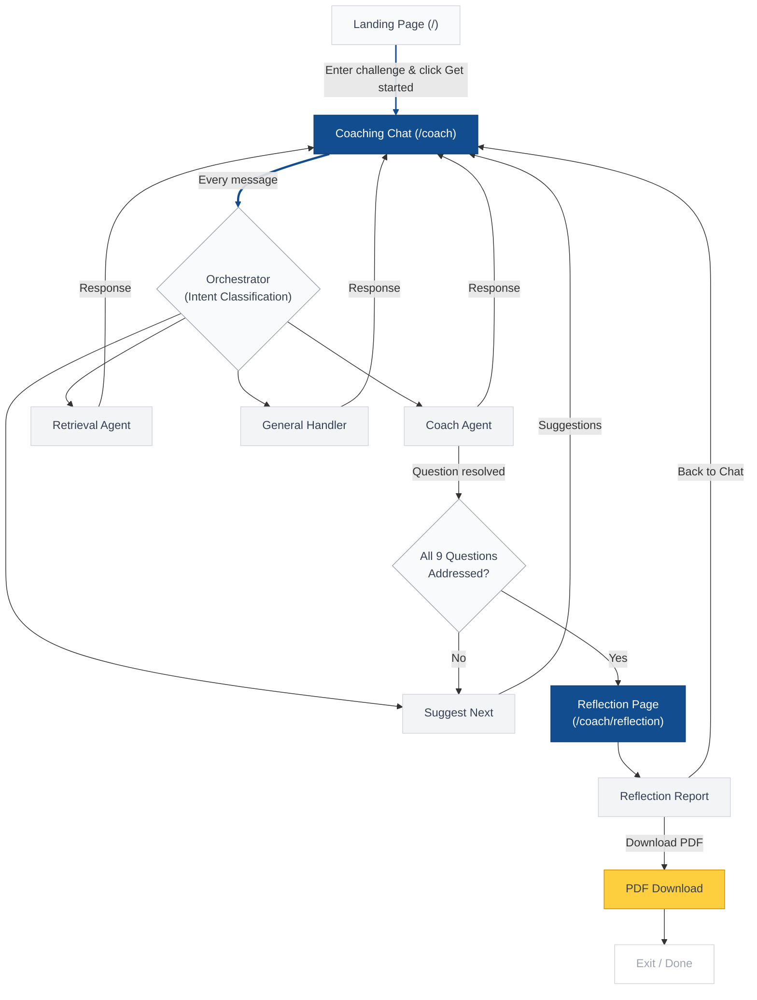

# User Journey Flow Diagram

## End-to-End User Flow



## Simplified Linear Flow

```
Landing Page → Coaching Chat → [Coach / Retrieve / Suggest loop] → Reflection → PDF Download → Exit
```

## Page-by-Page Breakdown

| Step | Page | Route | What Happens |
|------|------|-------|-------------|
| 1 | Landing Page | `/` | User describes their public engagement challenge |
| 2 | Coaching Chat | `/coach` | Orchestrator classifies intent, routes to coach/retrieval/suggest/general agent. Responses stream via SSE with citation badges. |
| 3 | Coaching Loop | `/coach` | User works through 9 GovLab questions one at a time. Each question resolves after 1-4 exchanges. Suggestions appear after each resolution. |
| 4 | Reflection | `/coach/reflection` | User clicks "Generate Reflection" (available after 1+ questions addressed). API builds reflection from session state. |
| 5 | Download | `/coach/reflection` | User downloads PDF with summary, strengths, gaps, and priority actions. |
| 6 | Exit | — | User leaves or clicks "Back to Chat" to continue. |

## Supporting Pages

| Page | Route | Purpose |
|------|-------|---------|
| Case Study Library | `/case-studies` | Browse/filter real-world engagement examples |
| Case Study Detail | `/case-studies/:id` | Full case study view with outcomes and steps |
| About | `/about` | Tool overview, framework explanation, knowledge base sources |
